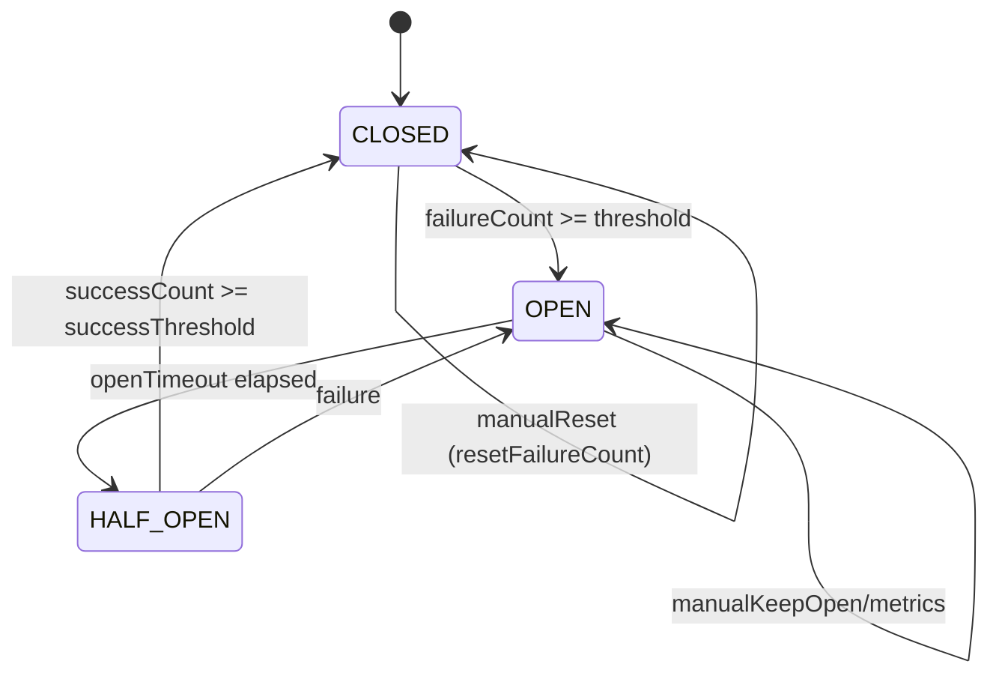
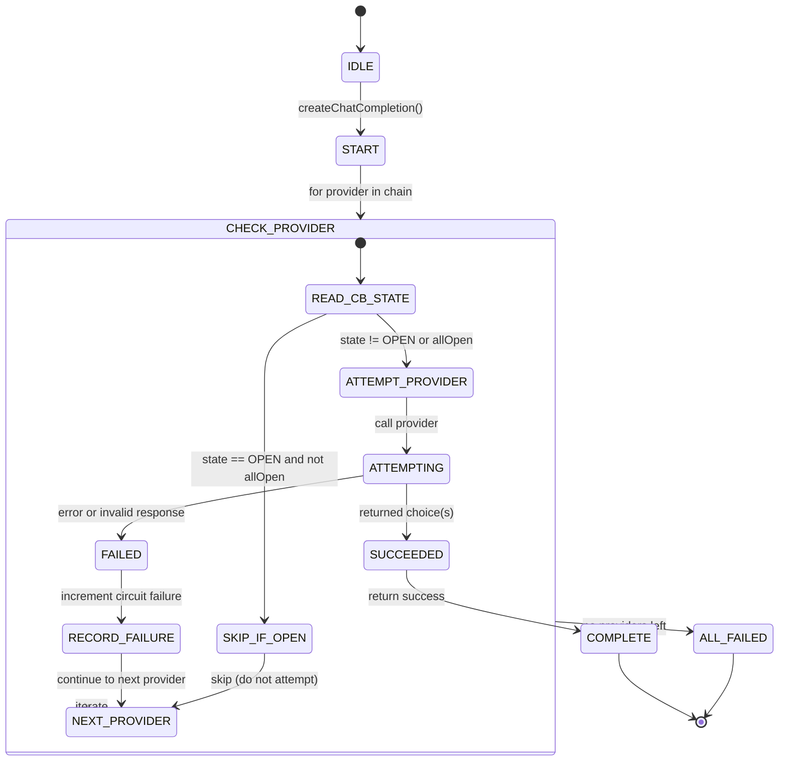
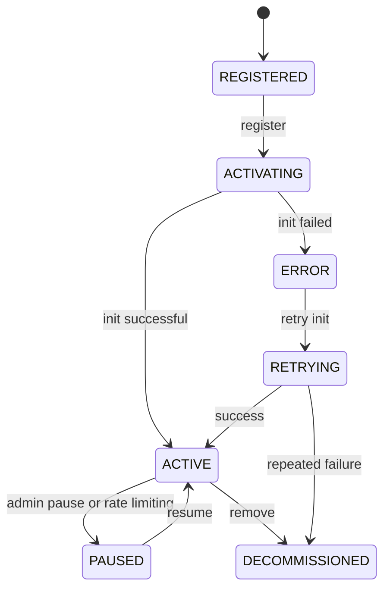
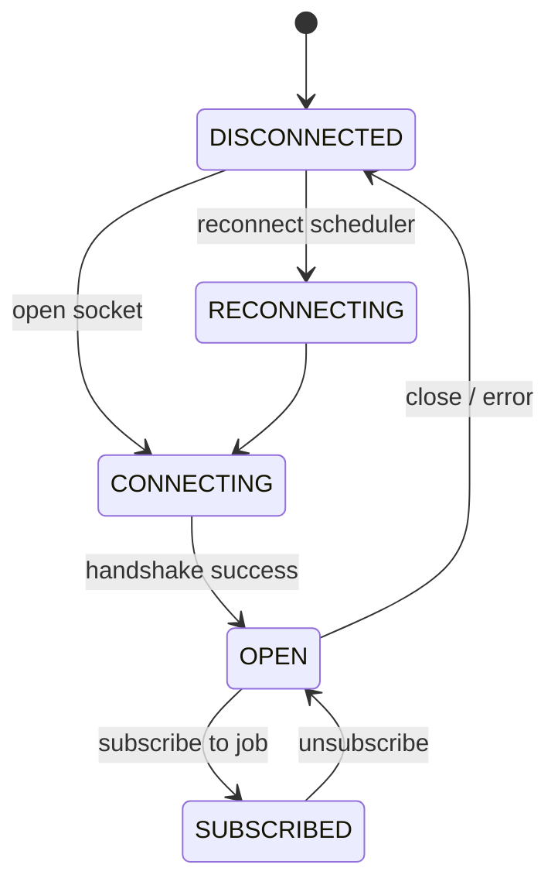
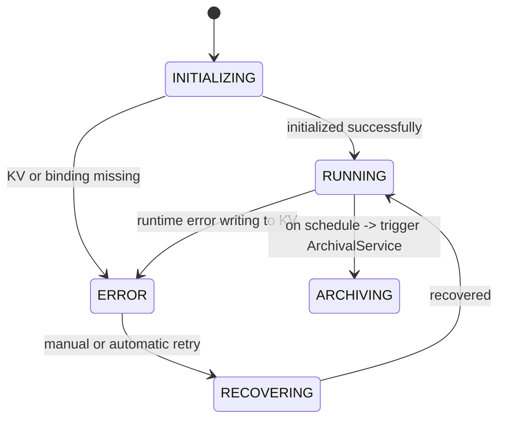
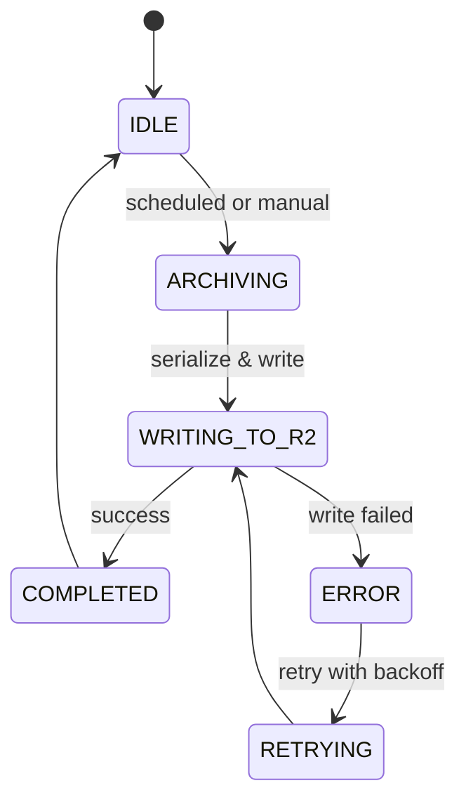

# State Machine Diagrams

This page documents state machines for key components in the project.

---

## 1) CircuitBreaker

Notes:
- `failureCount` increments on provider errors; when it reaches `failureThreshold` the breaker transitions to `OPEN`.
- `OPEN` transitions to `HALF_OPEN` after a configured timeout; `HALF_OPEN` allows limited calls for recovery.

---

## 2) FallbackAIClient — Provider Selection Flow

This state machine represents how the fallback client iterates providers and reacts to circuit states and results.

Notes:
- If *all* providers are `OPEN`, FallbackAIClient will attempt providers anyway (force attempts to allow recovery).
- On a provider `FAILED` result, FallbackAIClient records failures via the provider's circuit breaker.

---

## 3) Agent Lifecycle

Notes:
- Agents follow a clear lifecycle from registration to active service; operational tooling can pause/resume or decommission agents.

---

## 4) StreamingService (WebSocket) Connection State

Notes:
- Reconnection/backoff policies are implemented externally (reconnect scheduler). Subscribed state is a child state while socket is open.

---

## 5) MetricsCollector

Notes:
- MetricsCollector writes to KV and relies on the ArchivalService for long-term storage.

---

## 6) ArchivalService

Notes:
- ArchivalService snapshots metrics from KV to R2 and manages lifecycle (purge/retention).

---

### Files / Usage
- This document contains Mermaid diagrams. Use a renderer (Mermaid Live Editor, Markdown viewer supporting Mermaid, or `mmdc` CLI) to export to SVG/PNG for presentations.
- If you want, I can export these diagrams to SVG and add them to `docs/diagrams/` as standalone assets.

---

If you'd like additional components visualized (Gateway request lifecycle, Alerting flow, Dashboard update flow), tell me which and I'll add them.